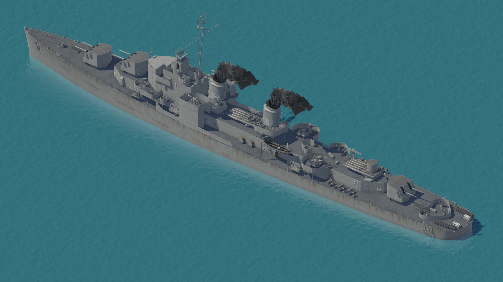

 # ScreenSpaceReflection for URP
Simplistic SSR implementation for forward renderer of URP. Can be used only for **othrographic** projection and due to lack of smothness information it uses diffrent method of defining which surface is reflective (reflects only on pixels which Y position equals 0). It's made with Unity 2021.1.24f1.

 
    

# Fix of depth normals of shader graph shaders
This shader uses depth normals provided by Unity but shaders created in shader graph dont draw its normals used in fragment stage to depth normal buffer. To workaround this problem we can just modify generated shader code: we need to change pixel shader function of "DepthNormal" pass. Just replace          
 
> `#include "Packages/com.unity.render-pipelines.universal/Editor/ShaderGraph/Includes/DepthNormalsOnlyPass.hlsl"`    

with contents of that file and change

> `return float4(PackNormalOctRectEncode(TransformWorldToViewDir(unpacked.normalWS, true)), 0.0, 0.0);` 

to   

> ` return float4(PackNormalOctRectEncode(TransformWorldToViewDir(surfaceDescription.NormalWS, true)), 0.0, 0.0);`

This requires that your shader graph is set to work with world space normals.